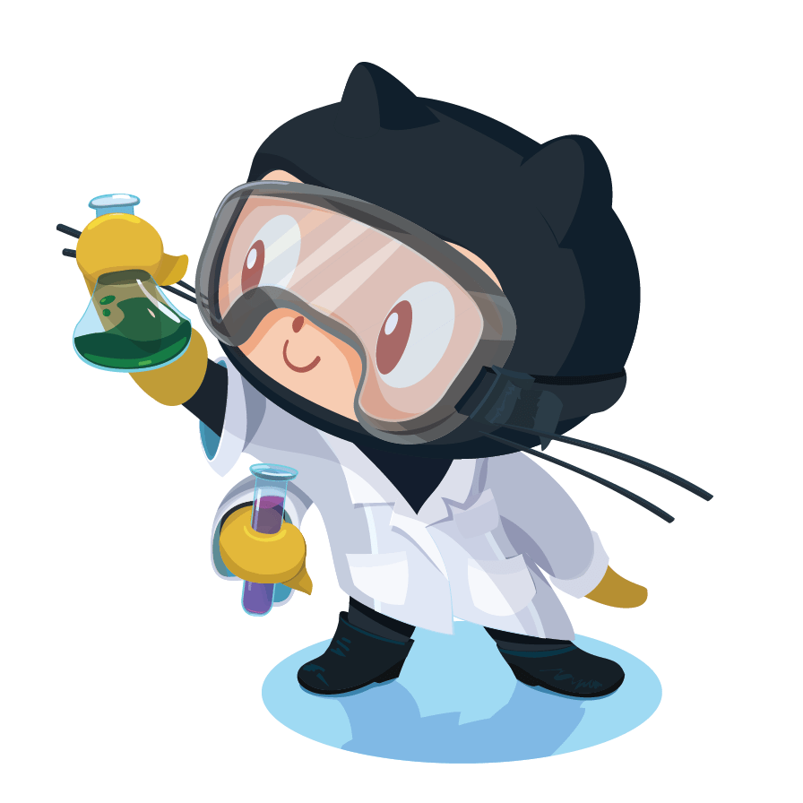

<!-- <CENTERED SECTION FOR GITHUB DISPLAY> -->
<div align="center">
  <a href="https://github.com/MNDL-27/hermes-brain">
    
  </a>
</div>

> **Persistent long-term memory for the Hermes AI agent ecosystem — turns Notion into a structured brain that never forgets.**
>
> [!TIP]
>
> **v1.0.0 released** — 7 databases, heuristic auto-capture, 5 tool interfaces, secret redaction, background sync.
>
> | [](https://github.com/MNDL-27) | Follow [@MNDL-27](https://github.com/MNDL-27) on GitHub for more AI infrastructure tools. |
> | :-----| :----- |
> | [](https://discord.gg/your-invite) | Join our [Discord](https://discord.gg/your-invite) for support, discussions, and early access. |

<div align="center">

  [](https://github.com/MNDL-27/hermes-brain/releases)
  [](https://github.com/MNDL-27/hermes-brain/graphs/contributors)
  [](https://github.com/MNDL-27/hermes-brain/network/members)
  [](https://github.com/MNDL-27/hermes-brain/stargazers)
  [](https://github.com/MNDL-27/hermes-brain/issues)
  [](https://github.com/MNDL-27/hermes-brain/blob/main/LICENSE)
  [](https://github.com/sponsors/MNDL-27)
</div>

---

## Overview

**hermes-brain** gives the Hermes AI agent a persistent, structured memory by writing conversation highlights into a Notion workspace. Instead of an agent forgetting everything at the end of a session, it remembers:

| Database | Purpose | Example |
|---|---|---|
| **Memory** | General notes, lessons, decisions | "We decided to use PostgreSQL" |
| **Tasks** | To-dos, reminders, deadlines | "Ship auth refactor by Friday" |
| **Projects** | Project context, milestones, roadmap | "MVP launching October 2026" |
| **Content** | Social media drafts, content ideas | "Draft Twitter thread on agent memory" |
| **Research** | Sources, citations, analysis | "BERT outperforms RoBERTa on XNLI" |
| **Career** | Job search, interviews, salary talks | "Target: $180k base + equity" |
| **Entities** | People, companies, tools, preferences | "Sarah prefers async communication" |

Two ways to save:
- **Automatic** — heuristic classifier detects tasks, decisions, research, content ideas, preferences from conversation
- **Manual** — explicit "Remember this: ..." via tool calls

Two ways to recall:
- **Prefetch** — before each turn, relevant memories load into agent context
- **Search** — "What did we decide about the database?"

---

## Features

- **7 Structured Databases** — Memory, Tasks, Projects, Content, Research, Career, Entities, each with domain-specific properties
- **Heuristic Auto-Capture** — Zero-LLM-cost extraction using keyword patterns (tasks, decisions, research, content, career, preferences)
- **5 Tool Interfaces** — `search`, `remember`, `task`, `content`, `research` exposed to the agent
- **Background Sync** — Non-blocking daemon thread writes to Notion; conversation never pauses
- **Secret Redaction** — Stripe, Notion, GitHub, Slack tokens auto-redacted before storage
- **Prefetch Context** — Smart recall loads relevant memories before each conversation turn
- **Session Summaries** — Automatic end-of-session summaries saved to Memory database
- **Disk Import** — Migrate existing `MEMORY.md` and `USER.md` into Notion
- **Idempotent Bootstrap** — Creates "Hermes Brain" page + 7 databases on first run
- **Cross-Platform** — Runs anywhere Python 3.10+ runs (Linux, macOS, Windows)

---

## More backends

The Notion backend in this repository is the only backend today, and it is free to use. There is no paid package, no companion repo, and no upgrade tier.

If you want storage in Obsidian, SQLite, Logseq, or a local Markdown vault:

1. **Build one yourself** — see [`BACKEND_SWAP_GUIDE.md`](BACKEND_SWAP_GUIDE.md).
2. **Sponsor the work** — sponsor button above. Sponsorships fund additional backends, not a paid product.

See [`BACKENDS.md`](BACKENDS.md) for the long-term plan.

---

## Installation

### Quick Start

```bash
# Install from PyPI (when published)
pip install hermes-brain

# Or install from source
git clone https://github.com/MNDL-27/hermes-brain.git
cd hermes-brain
pip install -e .
```

### Prerequisites

- **Python 3.10+**
- **Notion workspace** with an [internal integration](https://www.notion.so/my-integrations)
- **Hermes agent framework** (this is a plugin, not a standalone app)

---

## Setup

### 1. Create a Notion Integration

1. Go to [My Integrations](https://www.notion.so/my-integrations) → **New integration**
2. Name it (e.g., "Hermes Brain")
3. Enable capabilities: **Search**, **Read content**, **Update content**, **Insert content**
4. Copy the **Internal Integration Token** (starts with `ntn_`)

### 2. Configure Environment

```bash
export NOTION_API_KEY=ntn_xxxxx_xxxxx
export HERMES_HOME=~/.hermes
```

| Variable | Required | Description |
|---|---|---|
| `NOTION_API_KEY` | ✅ | Your Notion internal integration token |
| `HERMES_HOME` | ✅ | Directory for cache files (`notion_brain.json`) |
| `HERMES_NOTION_PARENT_PAGE` | Optional | Existing Notion page ID to use as parent (if no pages exist in workspace) |

### 3. Bootstrap Your Workspace

On first run, the plugin creates a **"Hermes Brain"** parent page and 7 databases under it:

```python
from hermes_brain import bootstrap, store

s = store.Store()
bootstrap.init(s)
```

If your Notion workspace has no pages, create one manually first, or set `HERMES_NOTION_PARENT_PAGE` to an existing page ID.

---

## Usage

The plugin registers 5 tools with the Hermes agent:

### Search Memories

```python
# Search across all 7 databases
notion_brain_search(query="database migration plan")

# Search specific database
notion_brain_search(query="Sarah", database="entities", max_results=5)
```

| Parameter | Type | Default | Description |
|---|---|---|---|
| `query` | string | required | Search query |
| `database` | string | `"all"` | Filter: `memory`, `tasks`, `projects`, `content`, `research`, `career`, `entities` |
| `max_results` | integer | `8` | Max results (1-20) |

### Remember Explicitly

```python
notion_brain_remember(
    title="Design review notes",
    content="Team agreed on Material Design 3 for the new dashboard",
    domain="projects",
    kind="decision",
    status="active",
    tags=["design", "dashboard"],
    entities=["Sarah", "Design Team"]
)
```

| Parameter | Type | Description |
|---|---|---|
| `title` | string | Short title (max 120 chars) |
| `content` | string | Full content/description |
| `domain` | string | `daily_work`, `projects`, `social_content`, `research`, `career`, `entities` |
| `kind` | string | `note`, `task`, `decision`, `preference`, `source_note`, `draft`, `lesson`, `reminder` |
| `status` | string | `active`, `done`, `draft`, `published`, `archived`, `needs_review`, `conflict` |
| `tags` | array | Tags for filtering |
| `entities` | array | People/companies/projects mentioned |

### Manage Tasks

```python
# Create task
notion_brain_task(
    action="create",
    title="Fix auth bug",
    priority="urgent",
    due="2026-08-01",
    project="Auth Refactor",
    tags=["backend", "security"]
)

# List tasks
notion_brain_task(action="list", status="active")

# Complete task
notion_brain_task(action="complete", page_id="<notion_page_id>")

# Update task
notion_brain_task(action="update", page_id="<id>", status="needs_review", priority="high")
```

### Manage Content

```python
# Create draft
notion_brain_content(
    action="create",
    title="Thread on AI Memory",
    body="Thread draft text...",
    platform="twitter",
    tags=["AI", "memory"]
)

# List content
notion_brain_content(action="list")

# Publish
notion_brain_content(action="publish", page_id="<id>")

# Archive
notion_brain_content(action="archive", page_id="<id>")
```

**Platforms:** `twitter`, `linkedin`, `instagram`, `tiktok`, `facebook`, `youtube`, `bluesky`

### Save Research

```python
# Save research
notion_brain_research(
    action="save",
    title="LLM Benchmarks 2026",
    content="Summary of findings...",
    tags=["LLM", "benchmarks"]
)

# List research
notion_brain_research(action="list")
```

---

## Automatic Capture

The plugin watches every conversation turn in a background thread. It detects these patterns automatically:

| Pattern | Database | Trigger Keywords |
|---|---|---|
| **Tasks** | Tasks | `remind me`, `todo`, `deadline`, `due`, `blocker`, `gotta`, `need to`, `will create`, `must fix` |
| **Decisions** | Projects | `decided`, `going with`, `moving forward`, `approved`, `greenlit`, `chosen`, `elect`, `cancelled`, `pivot` |
| **Research** | Research | `source`, `according to`, `findings`, `researched`, `cited`, `conclusion`, `analysis shows` |
| **Content** | Content | `draft`, `thread`, `tweet`, `publish`, `launch`, `campaign`, `hook`, `headline` |
| **Career** | Career | `interview`, `resume`, `salary`, `promotion`, `job`, `offer`, `negotiate`, `remote` |
| **Preferences** | Entities | `I prefer`, `I like`, `I hate`, `always`, `never`, `preferred`, `favorite`, `habit`, `routine` |

> **Note:** Classification is heuristic (regex-based), not semantic. It catches ~70% of actionable items. Missed entries are silent failures — use `notion_brain_remember` for anything critical.

---

## Data Model

Every memory entry in Notion has these common properties:

| Property | Type | Description |
|---|---|---|
| **Title** | Title | Extracted from triggering sentence (max 120 chars) |
| **Domain** | Select | `Daily Work`, `Projects`, `Social Content`, `Research`, `Career`, `Entities`, `Memory` |
| **Status** | Status | `active`, `done`, `draft`, `published`, `archived`, `needs_review`, `conflict` |
| **Tags** | Multi-select | Keyword tags (up to 8, deduplicated) |
| **Confidence** | Select | `high`, `medium`, `low` |
| **Kind** | Select | `note`, `task`, `decision`, `preference`, `source_note`, `draft`, `lesson`, `reminder` |
| **Source Session** | Rich text | Hermes session ID |
| **Last Seen** | Date | When entry was last updated |

### Per-Database Extras

| Database | Extra Properties |
|---|---|
| **Tasks** | Priority (`urgent`, `high`, `medium`, `low`), Due (Date), Project (Rich text) |
| **Content** | Platform (Select) |
| **Entities** | Kind (Select: `person`, `company`, `tool`, `project`, `topic`, `preference`) |
| **Memory** | Kind (Select: `note`, `preference`, `lesson`, `decision`, `reminder`) |

---

## Secret Redaction

Before any content is written to Notion, these patterns are automatically redacted:

| Pattern | Example | Replacement |
|---|---|---|
| Stripe keys | `sk_live_xxxxx` | `[REDACTED_SECRET]` |
| Notion tokens | `ntn_xxxxx` | `[REDACTED_SECRET]` |
| GitHub tokens | `ghp_xxxxx`, `gho_xxxxx`, `ghu_xxxxx`, `ghs_xxxxx`, `ghr_xxxxx` | `[REDACTED_SECRET]` |
| Slack tokens | `xoxb-xxxxx`, `xoxp-xxxxx`, `xoxr-xxxxx`, `xoxa-xxxxx`, `xoxs-xxxxx` | `[REDACTED_SECRET]` |
| Generic | `api_key=...`, `secret=...`, `token=...`, `password=...` | `[REDACTED_SECRET]` |

---

## Architecture

```
Conversation Turn
       │
       ▼
sanitize_context()  ──►  Strip PII, truncate
       │
       ▼
extract.classify_turn()  ──►  Regex matching → BrainEntry list
       │
       ▼
BrainEntry.normalized()  ──►  Domain normalize, secret redact, title clean, tag dedupe
       │
       ▼
store.create_database_page()  ──►  Notion API /pages
       │
       ▼
Notion Workspace (7 databases)
```

**Key Design Decisions:**

| Decision | Rationale | Upgrade Path |
|---|---|---|
| Heuristic-only (no LLM) | Zero token cost, zero latency | Swap regex for embedding classifier when coverage < 70% |
| Background thread sync | Non-blocking for agent loop | Replace with proper task queue if failure rate > 5% |
| Flat JSON cache (`notion_brain.json`) | Simple, no migration needed | Add versioning for multi-workspace support |
| 1900-char chunking | Notion's 2000-char block limit | Auto-upgrade when Notion increases limit |
| `requests` over `httpx` | Already in Hermes deps | Migrate to `httpx` when async needed |

---

## Configuration

Settings are stored in `$HERMES_HOME/notion_brain.json` (auto-generated):

```json
{
  "parent_page_id": "xxxxxxxx-xxxx-xxxx-xxxx-xxxxxxxxxxxx",
  "db_memory": "xxxxxxxx-xxxx-xxxx-xxxx-xxxxxxxxxxxx",
  "db_tasks": "xxxxxxxx-xxxx-xxxx-xxxx-xxxxxxxxxxxx",
  "db_projects": "xxxxxxxx-xxxx-xxxx-xxxx-xxxxxxxxxxxx",
  "db_content": "xxxxxxxx-xxxx-xxxx-xxxx-xxxxxxxxxxxx",
  "db_research": "xxxxxxxx-xxxx-xxxx-xxxx-xxxxxxxxxxxx",
  "db_career": "xxxxxxxx-xxxx-xxxx-xxxx-xxxxxxxxxxxx",
  "db_entities": "xxxxxxxx-xxxx-xxxx-xxxx-xxxxxxxxxxxx"
}
```

The cache maps database display names to Notion IDs. It's safe to delete — bootstrap will recreate it.

---

## Data Sources

| Database | Notion Property Schema |
|---|---|
| **Memory** | Title, Domain, Kind, Status, Tags, Confidence, Source Session, Last Seen |
| **Tasks** | Title, Domain, Status, Priority, Tags, Due, Project, Confidence, Source Session, Last Seen |
| **Projects** | Title, Domain, Status, Tags, Confidence, Source Session, Last Seen |
| **Content** | Title, Domain, Status, Platform, Tags, Confidence, Source Session, Last Seen |
| **Research** | Title, Domain, Status, Tags, Confidence, Source Session, Last Seen |
| **Career** | Title, Domain, Status, Tags, Confidence, Source Session, Last Seen |
| **Entities** | Title, Kind, Tags, Confidence, Source Session, Last Seen |

---

## Project Structure

```
hermes-brain/
├── __init__.py          # Plugin entry point, tool schemas, provider (850 lines)
├── schema.py            # BrainEntry dataclass, constants, normalization (169 lines)
├── extract.py           # Heuristic classifier (187 lines)
├── store.py             # Notion REST API client (260 lines)
├── bootstrap.py         # Workspace setup, database creation (249 lines)
├── plugin.yaml          # Plugin manifest
├── README.md            # This file
├── LICENSE              # All Rights Reserved
├── CONTRIBUTING.md      # Contribution guidelines
├── .gitignore
└── .github/
    ├── assets/
    │   └── hero.png     # Hero image for README
    ├── badges/
    │   └── coverage.svg # Coverage badge
    └── workflows/
        └── ci.yml       # GitHub Actions CI
```

---

## Contributing

Contributions are welcome!

1. Fork the repository
2. Create a feature branch: `git checkout -b feature/amazing-feature`
3. Make your changes
4. Run tests: `pytest` (when test suite exists)
5. Commit: `git commit -m 'Add amazing feature'`
6. Push: `git push origin feature/amazing-feature`
7. Open a Pull Request

### Development Guidelines

- Follow existing code style (type hints, docstrings, stdlib-first)
- Add tests for new functionality
- Update documentation as needed
- Keep commits focused and atomic

---

## Acknowledgments

- [Hermes Agent Framework](https://github.com/NousResearch/hermes-agent) — the agent ecosystem this plugin powers
- [Notion API](https://developers.notion.com/) — the persistent storage backend
- [Requests](https://docs.python-requests.org/) — HTTP client
- All contributors and users

---

## License

<p align="center">
  <a href="https://github.com/MNDL-27">
    
  </a>
</p>

<p align="center">
  <strong>All Rights Reserved © <a href="https://github.com/MNDL-27">MNDL-27</a></strong>
</p>

<p align="center">
  If you find this project useful, <strong>please consider starring it ⭐</strong> 
  or <a href="https://github.com/MNDL-27">following</a> for more AI infrastructure tools.
</p>