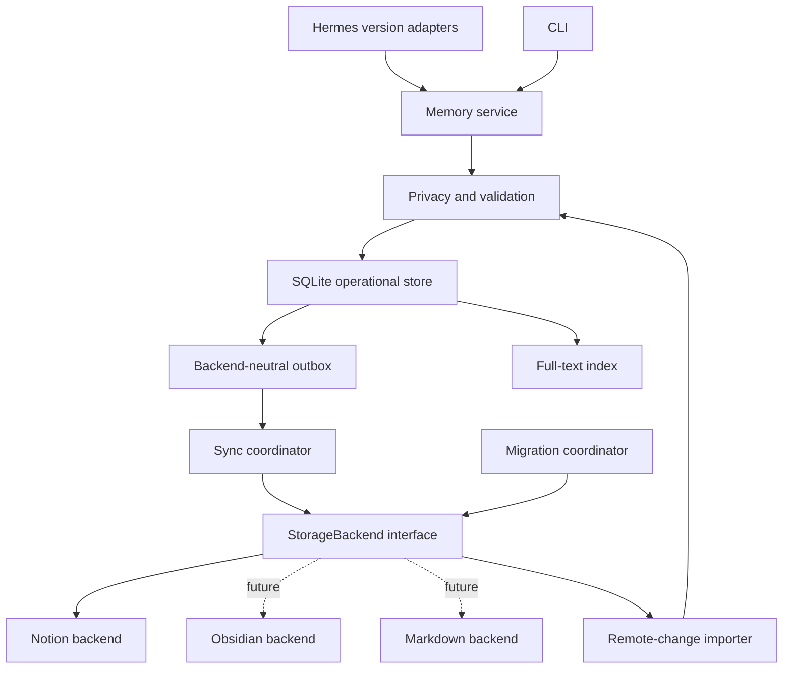
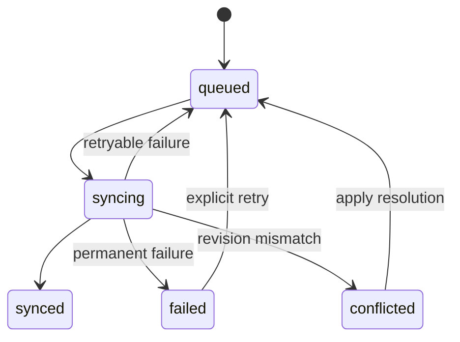

# Hermes Brain v1.0.1 Production Readiness Design and Roadmap

**Status:** Approved design; implementation in progress  
**Created:** 2026-07-25  
**Target release:** v1.0.1  
**Supported platform:** Linux  
**Current readiness estimate:** approximately 42% production-ready; reproducible baseline established  
**Completed workstreams:** 1 of 10

## Purpose

This document defines and tracks the work required to make Hermes Brain safe and reliable enough for its first production-ready PyPI release. It is both the approved technical design and the local release-readiness checklist.

The existing `v1.0.0` GitHub tag remains immutable. Version `v1.0.1` will be documented as the first production-ready and PyPI-published release.

## Current baseline

The repository already contains a meaningful implementation:

- Seven Notion databases and five tool handlers exist.
- Bootstrap, health, reset, extraction, prefetch, session handling, and a CLI exist.
- The package builds and installs as a Python library.
- The current suite has 175 passing tests and 20 strict expected-failure regression contracts across Python 3.11–3.13.
- Editor diagnostics report no errors or warnings.

The production-readiness audit identified these release blockers:

- Recall does not reliably retrieve full page bodies.
- Schema values and write payloads are inconsistent.
- Schema repair may archive databases without migrating their pages.
- Writes can report success without durable persistence.
- Background daemon threads can race and may not flush all writes.
- Some updates create duplicate pages instead of updating existing pages.
- Database-filtered search can ignore the query.
- Redaction does not cover every write path.
- The built wheel does not provide verified Hermes plugin discovery.
- Ruff and mypy currently fail.
- Branch-aware package coverage is 67%, below the 80% release gate.
- Real Hermes and live Notion integration are not sufficiently tested.
- The current working tree contains uncommitted user changes that must be preserved.

## Approved product decisions

| Decision | Approved direction |
|---|---|
| Release goal | Production-ready public v1.0.1 |
| Existing user data | Non-destructive and resumable migration is mandatory |
| Hermes compatibility | Latest stable Hermes release and its immediate predecessor |
| Supported platform | Linux only for release-blocking validation |
| Authoritative storage | One configured backend per profile; Notion for v1.0.1 |
| Future storage | Backend-neutral core prepared for Obsidian and similar adapters |
| Recall | Rebuildable local SQLite full-text index |
| Write durability | Transactional SQLite outbox and serialized synchronization worker |
| Conflict policy | Detect conflicts and preserve both versions for explicit resolution |
| Privacy policy | Configurable `redact`, `block`, and acknowledged `allow`; default `redact` |
| Automatic capture | Explicit opt-in and experimental for v1.0.1 |
| Local encryption | Optional, fail-closed when enabled but unavailable |
| Telemetry | Explicit opt-in Sentry adapter behind a replaceable provider interface |
| Specialized tools | Content and research disabled by default as experimental features |
| Live validation | Mocked tests on pull requests and scheduled/release live Notion tests |
| Release quality | Strict gate including clean lint/types, live tests, migration rehearsal, and at least 80% meaningful coverage |
| CLI | Support both `notion-brain` and `python -m notion_brain` |

## Stable v1.0.1 scope

The following capabilities are part of the stable compatibility and reliability promise:

- Full-body local search and Hermes prefetch
- Explicit memory capture
- Task creation, listing, updating, and completion
- Backend-neutral storage contract
- Production Notion storage adapter
- Durable local outbox and synchronization
- Remote-change import
- Conflict detection and explicit resolution
- Non-destructive schema migration and rollback
- Privacy modes and optional local database encryption
- Health, configuration, synchronization, migration, conflict, index, export, telemetry, and URL CLI commands
- Latest two stable Hermes releases
- Explicit Hermes installation shim under `$HERMES_HOME/plugins/notion_brain/`
- Opt-in, sanitized Sentry telemetry
- Portable data export
- Wheel and source distribution publication on PyPI

## Experimental and disabled by default

These capabilities remain available only behind explicit feature flags and do not receive the stable v1.0.1 compatibility guarantee:

- Heuristic automatic conversation capture
- Automatic session summaries
- Content workflow tools
- Research workflow tools
- Legacy import from `MEMORY.md` and `USER.md`

When enabled, experimental features must still use the same privacy, validation, durable-write, and error-reporting pipeline as stable features.

## Deferred beyond v1.0.1

- Obsidian, Markdown, Logseq, and standalone SQLite storage adapters
- Multi-backend mirroring
- Switching or migrating between authoritative backend types
- Semantic or vector search
- Windows and macOS support guarantees
- Permanent Notion deletion where the API exposes only archival

## Architecture



### Component boundaries

#### Hermes adapters

- Isolate lifecycle and registration differences between the two supported Hermes releases.
- The verified targets at design time are Hermes Agent `v0.19.0` (`v2026.7.20`) and `v0.18.2` (`v2026.7.7.2`); revalidate the latest-two policy immediately before release.
- Select the compatible adapter through explicit version or capability detection.
- Expose one stable internal provider contract to the rest of the package.
- Keep Hermes imports out of domain and persistence modules.
- Do not rely on the general `hermes_agent.plugins` entry-point path for memory-provider activation; these Hermes releases use their dedicated `$HERMES_HOME/plugins/<name>/` memory-provider discovery path.

#### Memory service

- Provide stable operations for search, recall, explicit memory capture, and task management.
- Use backend-neutral domain records.
- Coordinate validation, privacy, local transactions, and synchronization requests.
- Return truthful structured states rather than backend-specific responses.

#### Privacy and validation

- Normalize and validate all stable and experimental write paths.
- Apply the configured secret policy before data enters the local index, outbox, telemetry, logs, or remote backend.
- Use an allowlist for telemetry payload fields.
- Never place raw memory content or credentials in logs.

#### SQLite operational store

- Store canonical records, the full-text index, outbox operations, backend references, synchronization checkpoints, migration history, conflicts, and telemetry consent.
- Commit a record, index update, and outbox operation in one transaction.
- Recover pending work after process restart.
- Support optional encryption through an installable encryption implementation.
- Refuse to open an encryption-enabled profile without the required driver and key.

#### Synchronization coordinator

- Process durable outbox operations through one serialized worker per profile.
- Use idempotency keys and backend revisions.
- Respect backend retry guidance and bounded exponential backoff with jitter.
- Import external changes and refresh the local index.
- Preserve simultaneous local and remote changes as conflicts.

#### Storage backend contract

The core depends on a narrow `StorageBackend` contract. Implementations must be able to:

- Initialize and report health
- Create or update a canonical record idempotently
- Retrieve records and external changes
- Archive a record
- Return stable backend references and revision information
- Expose synchronization checkpoints
- Declare capabilities
- Plan and perform backend-specific migrations

The outbox contains canonical records and a backend identifier. Notion property names, page payloads, and block structures remain inside the Notion adapter.

#### Notion backend

- Implement complete pagination.
- Store and retrieve full page content blocks.
- Translate canonical records to consistent database properties.
- Handle rate limits, authentication, validation errors, and Notion API evolution.
- Support idempotent writes, remote revisions, external edits, and remote URLs.
- Pass the reusable backend contract suite.

#### Migration coordinator

- Separate read-only planning from mutation.
- Track migration state both locally and in backend metadata.
- Resume interrupted migrations.
- Verify copied records before switching active references.
- Leave the previous database intact for rollback.

#### CLI

Both entry forms call the same implementation:

```bash
notion-brain <command>
python -m notion_brain <command>
```

The command groups are:

```text
health
config validate
hermes install|status|uninstall
sync status|run|retry
migrate plan|apply|status
conflicts list|show|resolve
index rebuild|status
export
telemetry status|preview|enable|disable|reset-id
url
```

Potentially destructive cleanup requires explicit confirmation and is never part of `health`.

#### Hermes installation

Hermes Agent `v0.19.0` and `v0.18.2` discover external memory providers from `$HERMES_HOME/plugins/<name>/`. The PyPI package therefore provides an explicit installer rather than assuming that a general package entry point activates a memory provider.

`notion-brain hermes install` creates a small managed shim at `$HERMES_HOME/plugins/notion_brain/` containing a manifest and registration module that import the installed `notion_brain` package. The shim contains no duplicate provider implementation. It requires Hermes and Hermes Brain to be importable from the same Python environment; pipx users receive documented `pipx inject` instructions.

The installer:

- Accepts the active `HERMES_HOME` and an explicit override.
- Writes files atomically.
- Refuses to overwrite an unmanaged directory.
- Verifies provider import and Hermes memory-provider discovery after installation.
- Records that the shim is managed by Hermes Brain.
- Removes only managed shim files during uninstall and never removes memory data, SQLite state, or Notion content.
- Does not silently change `memory.provider`; activation remains an explicit setup step.

## Canonical data model

### Memory record

- Stable local UUID
- Title
- Body
- Kind
- Status
- Tags
- Source type and source reference
- Created and updated timestamps
- Optional backend-neutral metadata

### Task record

A task contains the memory fields plus:

- Priority
- Due date
- Project
- Completion state and timestamp

### Backend reference

- Backend name
- Remote record ID
- Remote revision
- Last successful synchronization time
- Remote URL when supported

### Outbox operation

- Operation UUID
- Record UUID
- Backend name
- Action
- Idempotency key
- Attempt count
- Next retry time
- Current state
- Safe error category

Outbox states follow this model:



### Conflict record

- Conflict UUID
- Record and operation references
- Local expected revision
- Current remote revision
- Detection timestamp
- Resolution state
- Safe references to both preserved versions

Supported resolutions are:

- Keep remote version
- Apply local version after explicit confirmation
- Preserve both as separate records

### Synchronization checkpoint

- Backend name
- Profile identifier
- Backend-specific cursor
- Last successful import timestamp

## Data flow

### Write flow

1. Hermes or the CLI submits a memory or task.
2. The service validates and normalizes the input.
3. The privacy policy redacts, blocks, or explicitly allows detected sensitive values.
4. One SQLite transaction writes the canonical record, updates FTS, and creates an outbox operation.
5. The caller receives `queued` with record and operation IDs.
6. The sync worker sends the operation through the configured backend.
7. Success records the backend ID and revision and changes the operation to `synced`.
8. Retryable failures remain durable and receive a later retry time.
9. Permanent failures remain visible for diagnosis and explicit retry.
10. Revision mismatches create a conflict without overwriting either version.

A response claims remote persistence only after the backend confirms it.

### Recall flow

1. Search reads full bodies from the local FTS index.
2. Normal conversational recall remains fast and non-blocking.
3. A background importer retrieves remote changes and updates the index.
4. A fresh-search option may wait for a backend refresh before querying.
5. Imported remote content passes through local privacy processing before indexing.
6. Existing remote content is not silently modified by local privacy processing.

### Source-of-truth rule

Notion is authoritative after successful synchronization. Before synchronization, the local outbox is authoritative for the pending operation. The local index is rebuildable and is never the only durable copy of a synchronized memory.

Exactly one authoritative backend is active per profile in v1.0.1.

## Migration design

Remote schema changes do not run automatically during startup or health checks.

### Command flow

1. `migrate plan` inspects the workspace without mutation.
2. `migrate apply` displays the plan and requires confirmation.
3. `migrate status` shows progress and verification results.
4. Interrupted operations resume from recorded migration state.

### Safe changes

Missing properties and select options may be added in place when the operation cannot invalidate existing records.

### Incompatible changes

1. Create a replacement database alongside the current database.
2. Copy every page, property, and content block with a stable migration identifier.
3. Verify record counts and content checksums.
4. Switch the active database reference only after verification.
5. Keep the original database intact for rollback.
6. Archive the original only through a separate confirmed cleanup operation.

Legacy unversioned workspaces receive a discovery and adoption migration. Migration never deletes a page.

## Error handling

The service distinguishes these error categories:

- Invalid configuration
- Authentication failure
- Privacy-policy rejection
- Retryable network or rate-limit failure
- Permanent backend validation failure
- Synchronization conflict
- Migration verification failure
- Local database or encryption failure
- Unsupported Hermes version

Retryable operations use bounded exponential backoff with jitter and respect Notion `Retry-After` guidance. Authentication and permanent validation failures do not retry indefinitely.

Tool and CLI responses use structured states including:

- `queued`
- `syncing`
- `synced`
- `blocked`
- `failed`
- `conflicted`

Diagnostics use operation IDs and safe error categories. They do not contain memory text, search queries, credentials, or secret samples.

## Configuration

The internal configuration is typed and stable even when Hermes versions expose different configuration shapes.

Conceptual configuration:

```yaml
memory:
  provider: notion_brain
  notion_brain:
    storage:
      backend: notion
    privacy:
      mode: redact
    capture:
      automatic: false
    local:
      encryption: false
    telemetry:
      enabled: false
      provider: sentry
    experimental:
      content: false
      research: false
      session_summaries: false
      disk_import: false
```

Credentials and encryption keys are supplied through documented environment variables or supported secret providers, not committed YAML.

## Privacy contract

- No runtime telemetry request occurs before explicit consent.
- Automatic conversation capture is disabled until explicitly enabled.
- `redact` is the default secret policy.
- `block` rejects a write containing a detected sensitive value.
- `allow` requires explicit acknowledgement that sensitive values may be stored.
- Raw memory content, titles, queries, tags, configuration, paths, credentials, and secret samples are excluded from logs and telemetry.
- Users can inspect, export, rebuild, and purge local operational data.
- Notion and the explicitly enabled telemetry provider are the only designed runtime network destinations for v1.0.1.

## Telemetry design

Telemetry is explicitly opt-in and replaceable.

### Provider boundary

- `NullTelemetrySink` is active before consent and when telemetry is disabled.
- `SentryTelemetrySink` is the initial production adapter.
- A future self-hosted sink can replace Sentry through configuration without changing memory or synchronization services.

### Sentry safeguards

- Disable default PII collection.
- Do not capture local variable values.
- Sanitize every event through an allowlist-based pre-send hook.
- Use a resettable random installation ID rather than user or machine identity.
- Send only low-volume package/version activation and coarse health events.
- Send sanitized error categories and stack locations.
- Apply conservative sampling to respect account limits.
- Keep consent, provider selection, and anonymous ID separate from memory records.

Users can inspect the allowed payload shape with `telemetry preview` before enabling collection.

## Testing strategy

### Unit tests

- Canonical records and validation
- Privacy modes and secret detection
- Telemetry consent and sanitization
- Outbox state transitions and retry scheduling
- Conflict detection and resolution
- Migration planning and verification
- Configuration parsing and version adaptation

### Backend contract tests

Every storage adapter must pass a reusable suite covering:

- Health and initialization
- Idempotent create and update
- Complete content retrieval
- Pagination
- Archival
- Revision handling
- External-change import
- Retryable and permanent failures
- Migration capabilities

### Local integration tests

- Real temporary SQLite databases
- FTS indexing, search, and rebuild
- Transactional record/index/outbox writes
- Restart and crash recovery
- Serialized workers
- Optional encryption success and fail-closed behavior

### Hermes compatibility tests

The latest stable Hermes release and its immediate predecessor are pinned in CI. Tests verify:

- Package/plugin discovery
- Provider lifecycle
- Tool registration and dispatch
- Prefetch
- Session switching and shutdown
- Configuration mapping
- Error propagation

### Live Notion tests

Scheduled and release workflows use a dedicated restricted workspace to verify:

- Bootstrap
- Full-body create and recall
- Updates without duplication
- Remote edits and import
- Pagination
- Rate-limit behavior where safely testable
- Conflict detection
- Legacy migration rehearsal
- Resume, verification, and rollback
- Cleanup of uniquely prefixed test resources

Forked pull requests never receive Notion or Sentry credentials.

### Packaging tests

- Build wheel and source distribution
- Run metadata validation
- Install into a clean environment
- Verify `plugin.yaml` inclusion
- Verify managed-shim installation into a temporary `HERMES_HOME`
- Verify dedicated Hermes memory-provider discovery in both supported releases
- Verify imports
- Verify `notion-brain` and `python -m notion_brain`
- Verify declared dependencies

## Mandatory release gate

Release v1.0.1 remains blocked until all of these are true:

- [ ] Ruff passes.
- [ ] Mypy passes for production and test code.
- [ ] Unit tests pass.
- [ ] Local integration tests pass.
- [ ] Both supported Hermes compatibility suites pass.
- [ ] Scheduled and release live Notion suites pass.
- [ ] Meaningful line coverage is at least 80%.
- [ ] Migration rehearsal, resume, verification, and rollback pass.
- [ ] Wheel and source distribution install correctly in clean environments.
- [ ] Hermes discovers the installed plugin.
- [ ] Dependency and secret scans pass.
- [ ] Privacy and telemetry documentation matches behavior.
- [ ] Installation, migration, recovery, and rollback documentation is complete.
- [ ] No unresolved P0 or P1 correctness, privacy, migration, or data-loss issue remains.
- [ ] Release artifacts and checksums are generated from the tagged commit.

## Workstream tracker

Status legend:

- `⬜` Not started
- `🟨` In progress
- `🟥` Blocked
- `✅` Complete

A workstream becomes complete only after its acceptance gate passes and the evidence is recorded in this document.

### 1. Baseline and characterization — ✅

- [x] Preserve current user changes before implementation work.
- [x] Pin reproducible development and CI tooling.
- [x] Record exact lint, typing, coverage, build, and package baselines.
- [x] Add characterization tests for current stable public behavior.
- [x] Add regression tests for every confirmed production blocker representable against the current API.
- [x] Document the two targeted Hermes releases and their provider contracts.

**Acceptance gate:** The baseline is reproducible, known bugs have failing regression tests, and no user work has been overwritten.

**Evidence:** See `docs/superpowers/baselines/2026-07-25-v1.0.1-baseline.md`. The locked suite produced 175 passes and 20 strict expected failures on Python 3.11, 3.12, and 3.13. Coverage is 67%; Ruff reports 97 findings and mypy reports 20 errors as recorded release debt. Wheel and source-distribution builds and Twine checks pass; clean-wheel inspection confirms Hermes discovery remains unresolved for Workstream 7.

### 2. Backend-neutral core — ✅

- [x] Add canonical memory, task, backend-reference, outbox, conflict, and checkpoint models.
- [x] Define the `StorageBackend` contract and capability model.
- [x] Introduce the stable memory-service boundary.
- [x] Preserve compatible public imports through facades.
- [x] Remove Notion-specific payloads from domain and service layers.

**Acceptance gate:** Domain and service tests pass without importing Notion or Hermes modules, and a fake backend passes the backend contract.

**Evidence:**
- Created `notion_brain/core/models.py` with canonical MemoryRecord, TaskRecord, BackendReference, OutboxOperation, ConflictRecord, SyncCheckpoint models
- Created `notion_brain/core/errors.py` with domain errors (ValidationError, BackendError, NotFoundError, ConflictError, PrivacyError, SyncError, ConfigurationError, MigrationError)
- Created `notion_brain/core/ports.py` with StorageBackend abstract interface, BackendCapabilities, SearchOptions, SyncResult
- Created `notion_brain/core/service.py` with MemoryService, RecordRepository, OutboxRepository, PrivacyEngine, PrivacyPolicy, ValidationEngine
- Created `notion_brain/core/__init__.py` exporting all core symbols
- Moved provider to `notion_brain/provider.py`
- Updated `notion_brain/__init__.py` as lazy facade preserving backward compatibility
- Created `notion_brain/compat/__init__.py` with converters between legacy BrainEntry and canonical models
- Added `tests/core/test_import_isolation.py` with 6 tests verifying import isolation and contract compliance
- All 6 core tests pass
- All 48 characterization tests pass
- Fake backend passes StorageBackend contract

### 3. Correct Notion adapter — ⬜

- [ ] Implement complete database and block pagination.
- [ ] Retrieve full memory bodies.
- [ ] Normalize schema option values and payload formats.
- [ ] Implement real updates without duplicate creation.
- [ ] Add backend revisions and idempotency handling.
- [ ] Add typed authentication, validation, rate-limit, and server errors.
- [ ] Pass the backend contract test suite.

**Acceptance gate:** Mocked and live tests prove full-body create, update, query, remote edit, and pagination behavior.

**Evidence:** Not recorded.

### 4. Local state and privacy — ⬜

- [ ] Add SQLite schema and migration framework.
- [ ] Add full-text indexing and deterministic rebuild.
- [ ] Commit canonical records, FTS changes, and outbox operations atomically.
- [ ] Implement `redact`, `block`, and acknowledged `allow` policies.
- [ ] Route every write path through validation and privacy processing.
- [ ] Add optional encrypted database support with fail-closed startup.
- [ ] Prevent raw content and credentials from entering logs.

**Acceptance gate:** Crash-recovery, privacy, indexing, rebuild, and encryption integration tests pass.

**Evidence:** Not recorded.

### 5. Synchronization and conflicts — ⬜

- [ ] Replace daemon-thread writes with one durable worker per profile.
- [ ] Add startup recovery for pending operations.
- [ ] Add bounded retries and `Retry-After` support.
- [ ] Add remote-change checkpoints and import.
- [ ] Detect revision conflicts.
- [ ] Preserve both versions and implement all three resolution choices.
- [ ] Expose truthful operation states.

**Acceptance gate:** Restart, retry, ordering, remote import, shutdown, and conflict tests pass without lost acknowledged writes.

**Evidence:** Not recorded.

### 6. Non-destructive migration — ⬜

- [ ] Add backend schema metadata and migration history.
- [ ] Implement read-only migration planning.
- [ ] Implement explicit apply and status operations.
- [ ] Adopt legacy unversioned workspaces without data loss.
- [ ] Add copy-and-switch migration for incompatible schemas.
- [ ] Verify counts and content checksums.
- [ ] Add resume and rollback behavior.
- [ ] Remove mutation from startup and health commands.

**Acceptance gate:** A production-like legacy workspace completes migration, interruption/resume, verification, and rollback with every original page intact.

**Evidence:** Not recorded.

### 7. Hermes integration — ⬜

- [ ] Implement adapters for the latest stable Hermes release and its predecessor.
- [ ] Verify provider lifecycle and configuration mapping.
- [ ] Stabilize search, prefetch, remember, and task tools.
- [ ] Preserve compatible legacy parameters where mappings are safe.
- [ ] Add the managed `$HERMES_HOME/plugins/notion_brain/` installer shim.
- [ ] Refuse to overwrite unmanaged plugin directories and uninstall only managed shim files.
- [ ] Verify dedicated memory-provider discovery in both supported Hermes releases.
- [ ] Include `plugin.yaml` and shim templates in installed distributions.

**Acceptance gate:** Both pinned Hermes versions discover and exercise the installed plugin successfully in clean environments.

**Evidence:** Not recorded.

### 8. CLI, configuration, and telemetry — ⬜

- [ ] Add the `notion-brain` console entry point.
- [ ] Keep `python -m notion_brain` equivalent.
- [ ] Add typed configuration and validation.
- [ ] Add health, sync, migration, conflict, index, export, telemetry, and URL commands.
- [ ] Add the telemetry sink interface and null implementation.
- [ ] Add explicit consent storage and inspection commands.
- [ ] Add the sanitized Sentry implementation.
- [ ] Verify that disabled telemetry performs no telemetry network request.

**Acceptance gate:** CLI, configuration, consent, sanitization, and provider-swapping tests pass; both CLI entry forms behave identically.

**Evidence:** Not recorded.

### 9. Experimental feature containment — ⬜

- [ ] Disable auto-capture by default.
- [ ] Disable session summaries by default.
- [ ] Disable content and research tools by default.
- [ ] Disable legacy disk import by default.
- [ ] Return clear messages when experimental features are disabled.
- [ ] Route enabled experiments through the stable privacy and outbox pipeline.
- [ ] Mark experimental behavior accurately in documentation.

**Acceptance gate:** Experimental features cannot activate without explicit configuration and cannot bypass stable safety controls.

**Evidence:** Not recorded.

### 10. Quality and release — ⬜

- [ ] Make Ruff and mypy pass.
- [ ] Reach at least 80% meaningful coverage.
- [ ] Add mocked pull-request CI.
- [ ] Add scheduled and protected live Notion workflows.
- [ ] Add dependency and secret scanning.
- [ ] Build and inspect release distributions.
- [ ] Verify clean installation and plugin discovery.
- [ ] Complete installation, privacy, telemetry, migration, recovery, and rollback documentation.
- [ ] Add release notes and changelog entry for v1.0.1.
- [ ] Configure PyPI Trusted Publishing with protected approval.
- [ ] Generate artifacts and checksums from the immutable release tag.

**Acceptance gate:** Every mandatory release checkbox is complete, protected CI is green, and the exact tagged artifacts pass a final clean-environment smoke test.

**Evidence:** Not recorded.

## Progress summary

| Workstream | Status |
|---|---|
| 1. Baseline and characterization | ✅ |
| 2. Backend-neutral core | ✅ |
| 3. Correct Notion adapter | ⬜ |
| 4. Local state and privacy | ⬜ |
| 5. Synchronization and conflicts | ⬜ |
| 6. Non-destructive migration | ⬜ |
| 7. Hermes integration | ⬜ |
| 8. CLI, configuration, and telemetry | ⬜ |
| 9. Experimental feature containment | ⬜ |
| 10. Quality and release | ⬜ |

**Workstream completion:** 1/10  
**Release gate:** Blocked  
**Next workstream:** Backend-neutral core

## Release procedure

After all mandatory gates pass:

1. Confirm the working tree contains only reviewed release changes.
2. Run the full pinned Linux test and quality matrix.
3. Run the protected live Notion suite and migration rehearsal.
4. Build wheel and source distribution from a clean checkout.
5. Inspect package contents and run clean-install smoke tests.
6. Publish to TestPyPI and repeat installation/discovery checks.
7. Create immutable tag `v1.0.1` from the verified commit.
8. Publish to PyPI through Trusted Publishing.
9. Create the GitHub release with artifacts, checksums, release notes, migration guidance, and telemetry disclosure.
10. Monitor opted-in sanitized Sentry events and documented support channels for release regressions.

## Risks and mitigations

| Risk | Mitigation |
|---|---|
| Notion API or schema behavior changes | Isolate it in one adapter, pin API behavior in contract tests, and run live scheduled tests |
| Migration interruption | Durable migration journal, idempotent copy operations, resume support, and no early archival |
| Concurrent local and remote edits | Revision checks and preserved conflict records |
| Process termination during writes | Transactional outbox and restart recovery |
| Optional encryption packaging problems | Linux-only validation, optional implementation, and fail-closed configuration |
| Hermes API or discovery changes | Version-specific adapters, managed-shim installation, and two pinned compatibility suites |
| Sentry quota or provider change | Conservative sampling and replaceable telemetry sink |
| Telemetry privacy regression | Explicit consent, allowlist sanitization, preview command, and dedicated privacy tests |
| Premature backend abstraction | Keep the contract limited to operations required by the stable Notion-backed service |

## Document maintenance

Update this file whenever a workstream changes state:

1. Change its status symbol.
2. Check only acceptance items demonstrated by validation.
3. Record commands, test results, commit references, and relevant artifacts under **Evidence**.
4. Update the progress summary and next workstream.
5. Keep the release blocked until every mandatory gate is complete.
